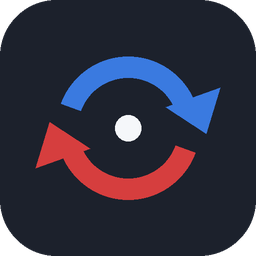

<div align="center">



# RussTeam

**Перенос изменений между разными проектами Roblox Studio**

Разные аккаунты, разные карты, разные города — общий обмен.

[](https://github.com/vvladislovv/RussTeam/releases)
[](https://create.roblox.com/store/asset/97875424740318/RussTeam)
[](LICENSE)

[Скачать](#скачать-и-запустить) · [Как работает](#как-это-работает) · [Архитектура](docs/ARCHITECTURE.md) · [Ошибки](#если-что-то-не-работает) · **[English](README.en.md)**

</div>

---

## Зачем это

Roblox умеет совместную работу только внутри **одного** места. Если вы с напарником
делаете **разные проекты** и хотите переносить друг другу детали, модели и скрипты —
штатного способа нет.

RussTeam переносит. Ты работаешь у себя, напарник у себя, изменения ходят между вами
через небольшой сервер-посредник.

```
   Studio #1                  сервер                  Studio #2
  ┌──────────┐    отдал     ┌──────────┐   забрал    ┌──────────┐
  │ проект A │ ──────────>  │  канал   │ ─────────>  │ проект Б │
  │          │ <──────────  │          │ <─────────  │          │
  └──────────┘    забрал    └──────────┘   отдал     └──────────┘
```

Сервер нужен потому, что **вы не бываете за компьютером одновременно**. Он держит
изменения, пока второй в офлайне: поработал ночью — напарник забрал утром.

## Что переносит

| Переносится | Не переносится |
|---|---|
| Детали, модели, папки: позиции, повороты, размеры | **Union / Negate** — форма живёт на серверах Roblox |
| Меши с текстурами, точностью отрисовки и столкновений | **Terrain** — воксели не влезают в обмен |
| Материалы, цвета, прозрачность, отражение, физика | **Приватные ассеты** — едет ссылка, не файл |
| Сварки и связи: `WeldConstraint`, `Motor6D`, констрейнты | Персонажи и манекены (всё с `Humanoid`) |
| Интерфейсы: `ScreenGui`, `SurfaceGui`, `BillboardGui` | `Camera`, `Animator` — их создаёт движок |
| Декали, частицы, свет, звук, эффекты освещения | |
| Скрипты всех видов, Value-объекты | |

## Скачать и запустить

### 1. Поставить плагин

**Из каталога Roblox** — [страница плагина](https://create.roblox.com/store/asset/97875424740318/RussTeam), ставится в один клик, обновления приходят сами.

**Файлом** — скачай [`RussTeam.rbxm`](RussTeam.rbxm), положи в папку плагинов Studio
(вкладка *Plugins* → кнопка **Plugins Folder**) и перезапусти Studio.

> На Windows достаточно закрыть окно. На Mac нужен **Cmd+Q** — крестик программу не закрывает.

### 2. Поднять сервер

Нужна любая машина с Python 3, доступная из интернета. Домен и сертификат не нужны:
Studio работает и по обычному `http://`.

```bash
scp server/server.py root@ВАШ_СЕРВЕР:/opt/russteam/server.py
ssh root@ВАШ_СЕРВЕР
mkdir -p /opt/russteam/data
python3 /opt/russteam/server.py
```

При первом запуске сервер сам создаст ключ доступа и напишет его в консоль:

```
создан ключ доступа: rt_XXXXXXXXXXXXXXXXXXXXXXXXXXXX
RussTeam слушает 0.0.0.0:8770, данные в /opt/russteam/data
```

Чтобы работал постоянно — поставь службой, [пример юнита systemd](docs/DEPLOY.md).

### 3. Соединиться

Открой панель кнопкой **RussTeam** и заполни три поля — один раз, дальше запомнится:

| Поле | Что вписать |
|---|---|
| Адрес сервера | `http://ВАШ_АДРЕС:8770` |
| Ключ доступа | строка из консоли сервера, начинается с `rt_` |
| Канал | любой общий код, например `TEAM-4821` |

Жми **Подключиться**. Полоса станет зелёной, в тулбаре загорится огонёк.

Те же три строки передай напарнику. **Ключ и канал — пароли**, шли личным сообщением.

## Как это работает

Плагин раз в 5 секунд сравнивает проект с тем, каким видел его в прошлый раз, и
отправляет **только разницу**: что добавили, что изменили, что удалили. Проект целиком
никуда не уезжает.

Приём такой же: сервер отдаёт всё, чего ты ещё не видел, и плагин применяет это сам.
Один заход — один запрос.

Опознание объектов идёт по скрытому атрибуту, который едет вместе с объектом. Поэтому
переименование или перетаскивание в другую папку не создаёт дубликат.

Подробности — [docs/ARCHITECTURE.md](docs/ARCHITECTURE.md).

## Возможности

**Живой режим** — обмен идёт сам. Выключается кнопкой внизу панели, тогда всё только по кнопке.

**Кто в канале** — видно, кто на месте и кто прямо сейчас правит проект. Оранжевая точка
означает, что у человека есть неотправленные изменения.

**Конфликты** — если оба правили один объект, он не применяется молча: даётся выбор
«взять чужое» или «оставить своё».

**Догон после офлайна** — сервер хранит изменения, пока их не забрали **все** участники.
Ушёл на неделю — накопленное дождётся.

**Пауза на время игры** — при нажатом Play обмен останавливается: Studio в этот момент
сама создаёт персонажей, и они не имеют отношения к проекту.

**Предохранитель** — если приходит больше 400 изменений за раз, нужно подтвердить кнопкой.
Защита от того, чтобы сбойный обмен молча не снёс полпроекта.

## Пределы

Замеры на живой Studio:

| Что | Сколько |
|---|---|
| Одно изменение | ~180 байт |
| Studio отправляет за раз | 3,5 МБ ≈ 20 000 изменений за 0,66 с |
| Крупное режется на порции | по 8000 изменений, общий объём не ограничен |
| Лента одного участника | 512 МБ ≈ 3 000 000 изменений |
| Обход проекта | 1700 объектов за 0,02 с |
| Сервер держит | до 400 человек одновременно без ошибок |

## Если что-то не работает

| Что видно | В чём дело |
|---|---|
| Кнопки нет в тулбаре | Studio не перезапущена полностью. На Mac нужен `Cmd+Q` |
| `сервер не принял ключ доступа` | Ключ скопирован не целиком. Копируй, не перепечатывай |
| `сервер недоступен` | Потерялся `http://` или порт `8770` в адресе |
| `по этому адресу отвечает не RussTeam` | Адрес ведёт на другую программу |
| `слишком частые запросы` | Больше 300 запросов в минуту с адреса. Подожди минуту |
| Меш приехал белым блоком | Ассет меша приватный. Расшарь его или используй публичный |
| `идёт запуск игры, обмен на паузе` | Останови Play — во время игры обмен не идёт |
| Ничего не приходит | Проверь, что канал у обоих написан **одинаково**, до символа |

Ошибки плагин пишет в **View → Output** предупреждениями. Для подробного разбора
поставь `Config.VERBOSE = true`.

## Для разработчиков

```
plugin/               исходники плагина
  init.server.lua     связывает части
  Config.lua          пределы, классы, свойства
  Serialize.lua       свойства в JSON и обратно
  Tree.lua            обход проекта и сравнение
  Apply.lua           применение чужих изменений
  Net.lua             разговор с сервером
  Panel.lua           панель в Studio
server/server.py      сервер-посредник
docs/                 архитектура и развёртывание
```

Сборка через [Rojo](https://rojo.space):

```bash
rojo build -o RussTeam.rbxm     # файл для папки плагинов
./check.sh                       # синтаксис, потерянные связи, несуществующие вызовы
```

## Автор

**vvladislovv**

[](https://github.com/vvladislovv)
[](https://t.me/vvladislovv)
[](https://www.roblox.com/users/707163568/profile)

Нашёл ошибку или есть идея — [открой issue](https://github.com/vvladislovv/RussTeam/issues).

## Лицензия

[MIT](LICENSE) — делай что хочешь, но без гарантий.
